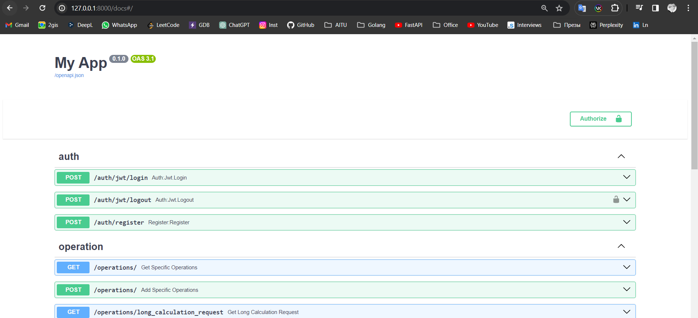
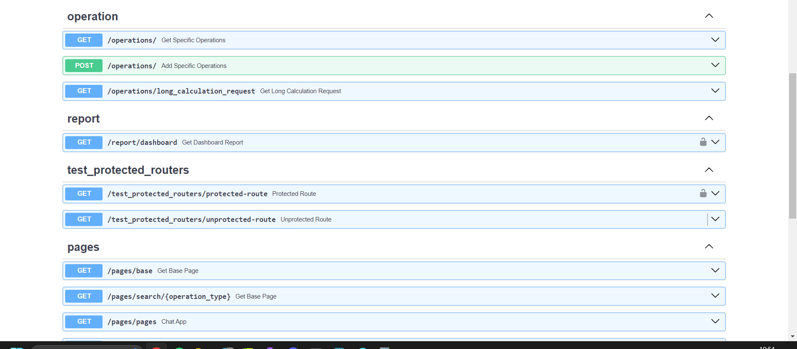

# FastAPI_course 

<meta charset="utf-8">
 Hello!   
 <b> Here is the full story of my code written during 
the course from author Artem Shumeiko.</b>   
Link of the course: 
<a href="https://www.youtube.com/watch?v=7IdfnjXsdN4&amp;list=PLeLN0qH0-mCVQKZ8-W1LhxDcVlWtTALCS&amp;ab_channel=%D0%90%D1%80%D1%82%D1%91%D0%BC%D0%A8%D1%83%D0%BC%D0%B5%D0%B9%D0%BA%D0%BE"> 
click</a> 

<text> <b> There are FastAPI App. </b> </text>  
<text> <b>  The main technologies used to build the application:</b> </text>   
<a href="https://fastapi.tiangolo.com/"> <b>FastAPI </b></a>: main Framework 
<b> <a href="https://fastapi-users.github.io/fastapi-users/12.1/"> FastAPIUsers</a> </b>
<text>: for Authentication. Use JWT and Cookie technologies</text>  
<b> <a href="https://github.com/long2ice/fastapi-cache"> FastAPICache</a> </b> 
<text>: A utility that helps you cache data. Works in conjunction with Redis </text>  
<b> <a href="https://redis.io/"> Redis</a> </b>
<text>: Main, default for caching database.</text>  
<b> <a href="https://docs.sqlalchemy.org/en/20/"> SQLALchemy</a> </b>
<text>used SQLAlchemy for a high-level, object-relational interface to interact with the underlying database </text>  
<b> <a href="https://docs.pydantic.dev/latest/"> PyDantic</a> </b>
<text>: data validation</text>  
<b> <a href="https://www.postgresql.org/"> PostgreSQL</a> </b>
<text>: Main Database</text>  
<b> <a href="https://jinja.palletsprojects.com/en/3.1.x/">Jinja2</a> </b>
<text>: Web page templateizer for API visualization</text>  

<text> <b> This is a tutorial pet project where I showed the technology stack I 
knew at the time I finished this repository. 
</b> </text>

<text>
<b> This project has: </b>  
1) User Authorization and Registration.  
2) Protected endpoints  
3) Adding and fetching records from the database.  
3.1) There is a visualized dynamic page for fetching records  
4) Simple cached endpoints  
5) Background tasks. Simple endpoint for sending emails to users.  
6) Online chat.
</text> 

<text> <b> Docs Endpoints list: </b> </text>

<h3> My Contacts </h3>
<b> Telegram: 
  
 Gmail: 
 </b>