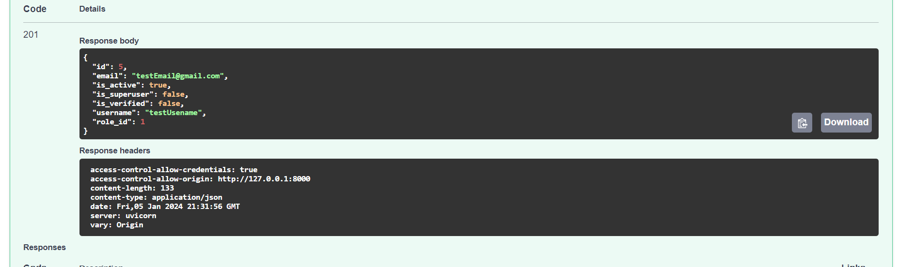
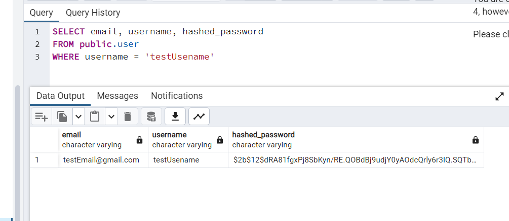
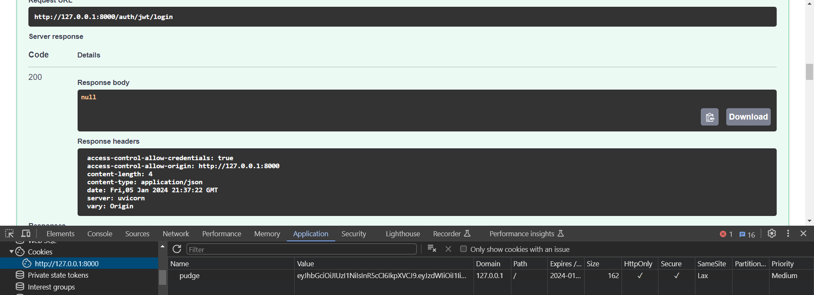

<h1> Auth logic</h1>

 
<text> JWT, Cookie </text>  
<text> Main router in router.py. </text>  
<text> Working with <b>Pydantic, SQLAlchemy, PostreSQL, FastAPIUsers</b> </text>   

<text> <b> Emaple: </b> </text>
 
 
