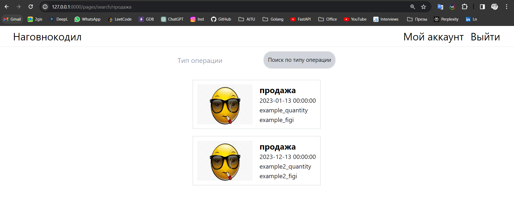
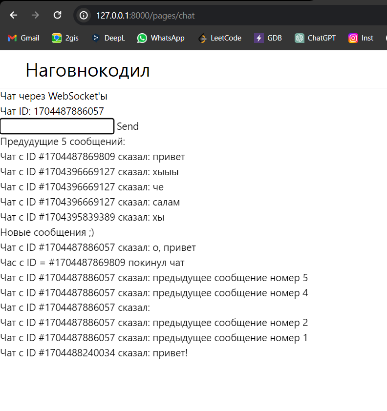
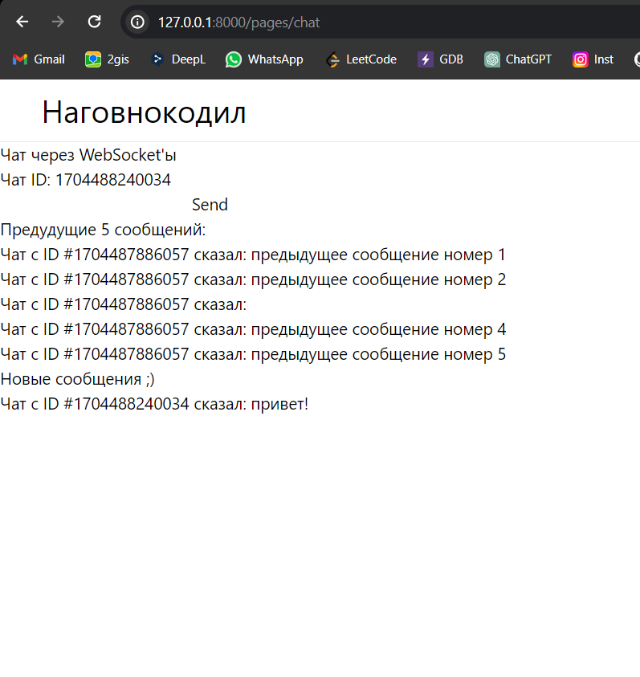
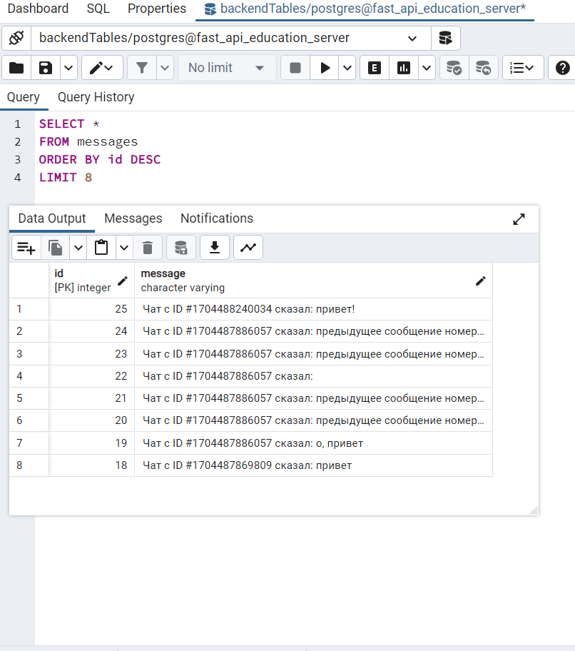

<h1> Jinja2Templates logic</h1>

<text> Working with <b>Jinja2Templates, Database</b> </text>
  
 
<h3> Dymamic pages </h3>
<text> 1) 1-sd page can show to us specific operations. Path: "/pages/search/. Example:</text>

2) Chat page. Path: "/pages/chat" Exaple:
<table>
    <tr> 
        <td>  </td> 
        <td>  </td> 
        <td>  </td> 
    </tr>
</table>