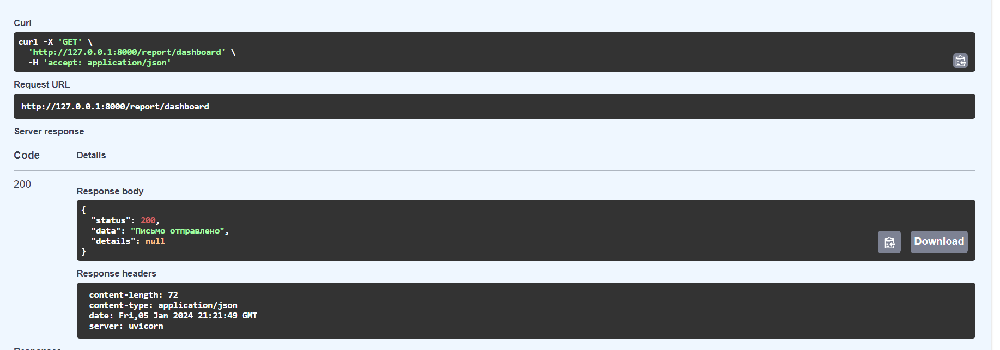
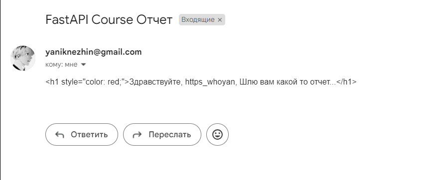

<h1> Dashbord Send to Email Logic</h1>

 
<text> Simle email sender to user email script </text>
<text> Main router in router.py. </text>  
<text> Working with <b>Celery, BackGroundTasks, Email lib.</b> </text>   

<text> <b> Example: </b> </text>  
 
 